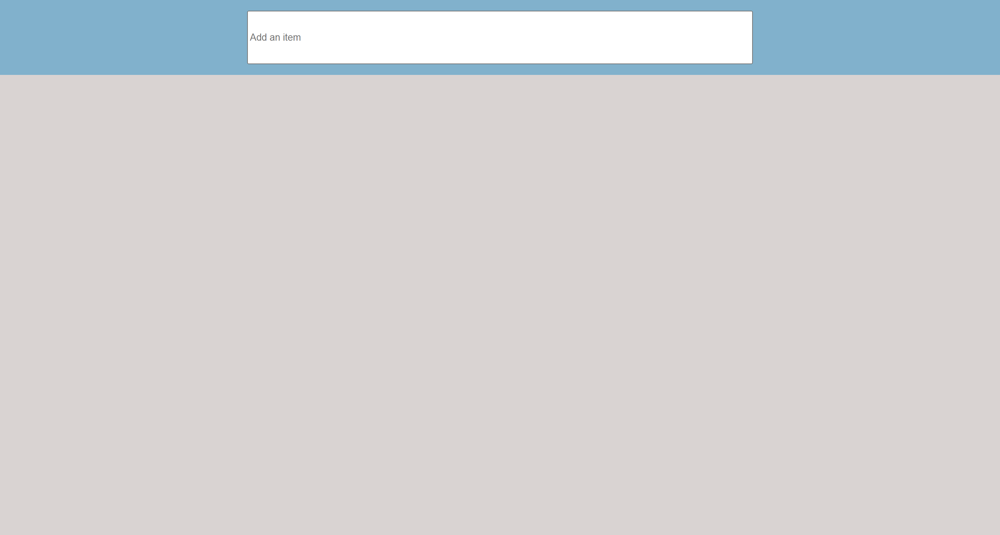
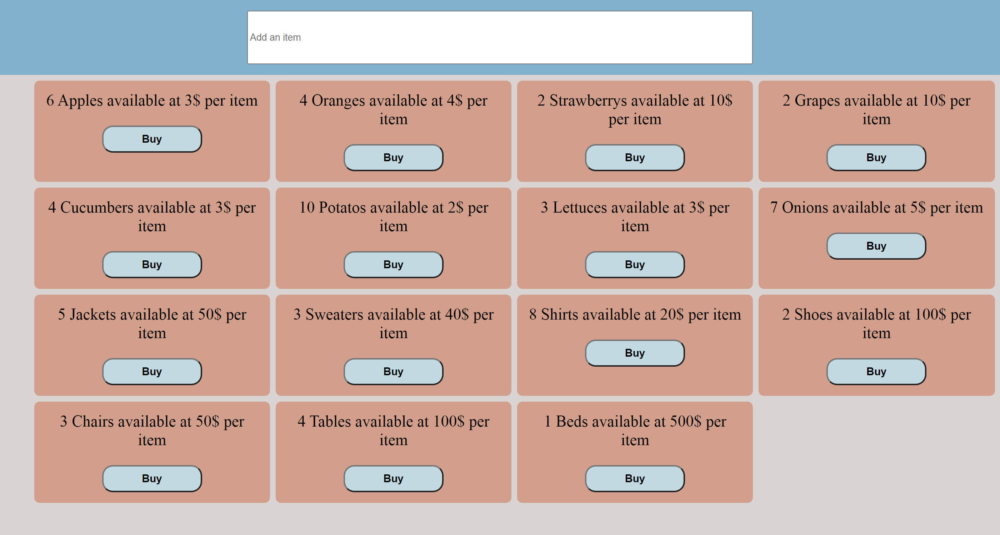
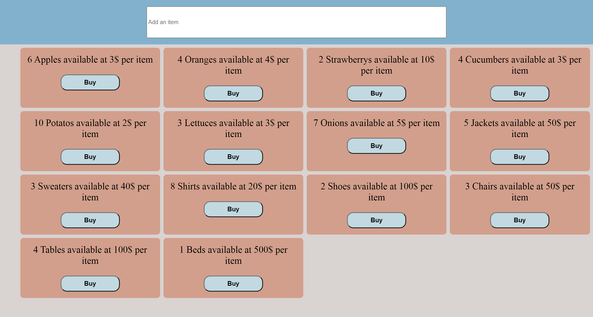

# Agora 🏬

Agora project is a simple shop using React and MobX. **Agora** in ancient Greece served as a marketplace where merchants kept stalls or shops to sell their goods amid colonnades.

## 📷 project Screenshots

The user can add items to store, double click to change its price, and buy items until the quantity is zero where it will be removed.

 
 
 

## 💻 Technology used

- Client-side: React, MobX

## 🔧 Getting Started

- Clone this repository. You will need `node`, `npm`installed globally on your machine.
- Run `npm install`
- Run `npm start` in another terminal 

